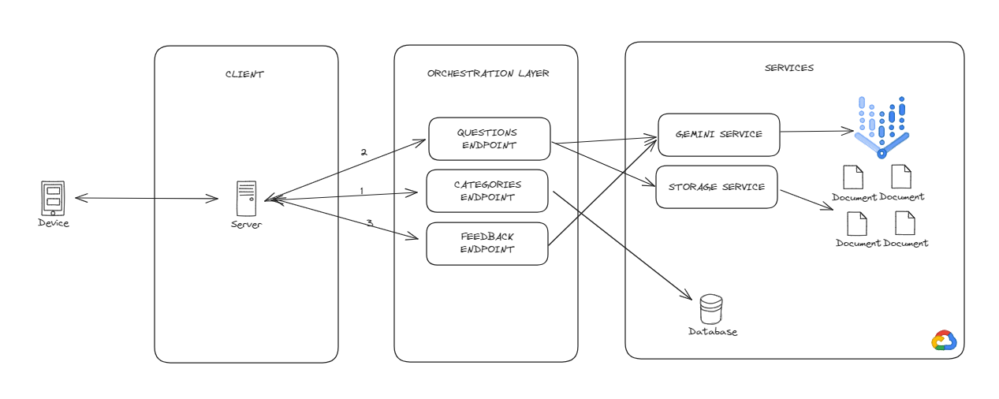

# Title: SafetyBud

## Prototype


## Table of Contents
- [Prototype](#prototype)
- [Overview](#overview)
- [Diagram](#diagram)
- [Gemini](#gemini-role) 
- [Usage](#usage)
- [No Docker](#running-each-service-individually)
- [Credits](#credits)

## Overview
Our project is a safety training app. The user selects one category, and the app will generate relative questions tailored for engineering professionals to test and give final answers and instructions. It provides them with a comprehensive platform to undergo safety training with no associated costs. 

## Diagram


## Gemini
GenAI algorithms can analyze students' strengths, weaknesses, and learning styles to tailor educational content and training programs specifically to individual needs. This ensures that each student receives personalized instruction that maximizes their learning potential.


## Usage

This application can be run using Docker Compose.

To get started, follow these steps:

1. Clone the repository:
    ```bash
    git clone https://github.com/rodoshi16/Genesis.git
    ```

2. Navigate to the cloned directory:
    ```bash
    cd Genesis
    ```

3. Run Docker Compose to build and start the application:
    ```bash
    docker-compose up --build
    ```

After that, navigate to [http://localhost:4200](http://localhost:4200) to see it in action.

### Running Each Service Individually

Alternatively, if you prefer not to use Docker, you can run each service individually. Here are the steps:

1. Clone the repository:
    ```bash
    git clone https://github.com/rodoshi16/Genesis.git
    ```

2. Navigate to the cloned directory:
    ```bash
    cd Genesis
    ```

3. Start each service individually. For example:
    - For the frontend service:
        ```bash
        cd client
        npm install -g @angular/cli
        npm install
        npm run start
        ```
    - For the backend service:
        ```bash
        cd backend
        python -m pip install -r requirements.txt
        uvicorn main:app --reload
        ```

After starting the services, you can access the application at [http://localhost:4200](http://localhost:4200) for the frontend and the respective backend endpoint.

## Credits

Special thanks to the following GitHub users for their contributions to this project:

- [@oscaru21](https://github.com/oscaru21)
- [@Ceciliali1205](https://github.com/Ceciliali1205)
- [@rodoshi16](https://github.com/rodoshi16)
- [@Jpe_main_Wang](https://github.com/Jpe_main_Wang)

We appreciate the time and effort invested by these contributors to make this project better.